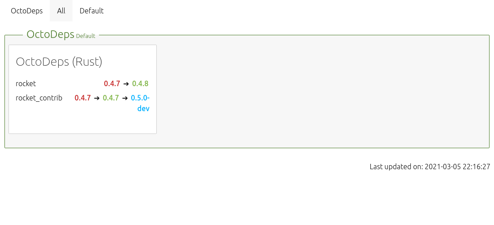

# OctoDeps

Simple tool to track projects dependencies.

## Disclaimer

Under development tool. Not ready to use.

## Screenshots



## Developper

### Technologies

- Rust 1.53.0-nightly
- [Rocket](https://rocket.rs/) framework
- [Tera](https://tera.netlify.app) for templating

### Setup

- install Rust nightly with rustup:

```sh
rustup override set nightly
```

- run locally

```sh
cargo run
```

- build for deploy

```sh
cargo build --release
```
